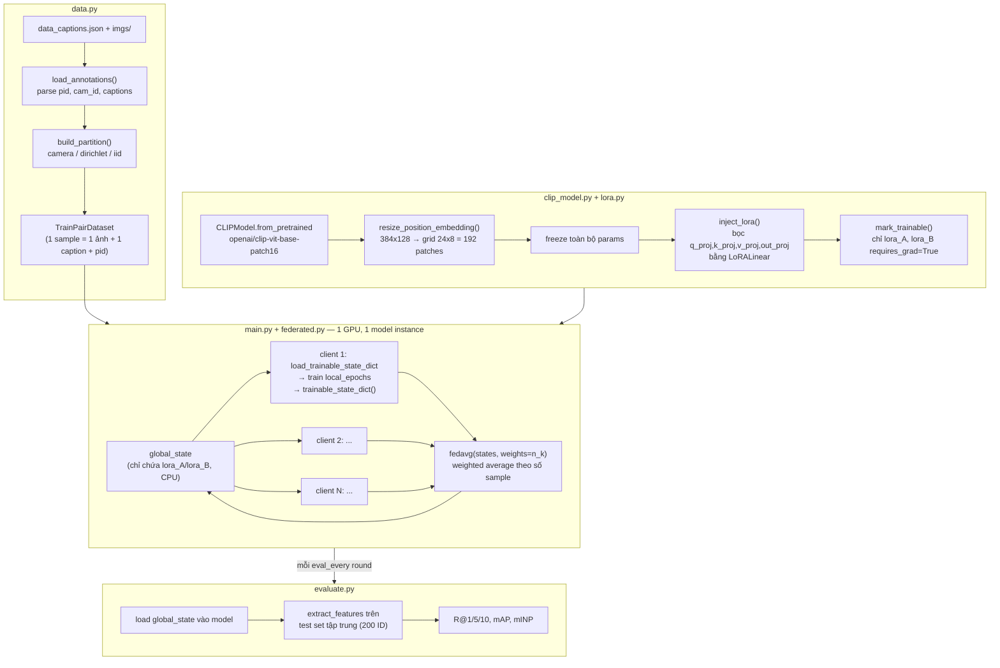
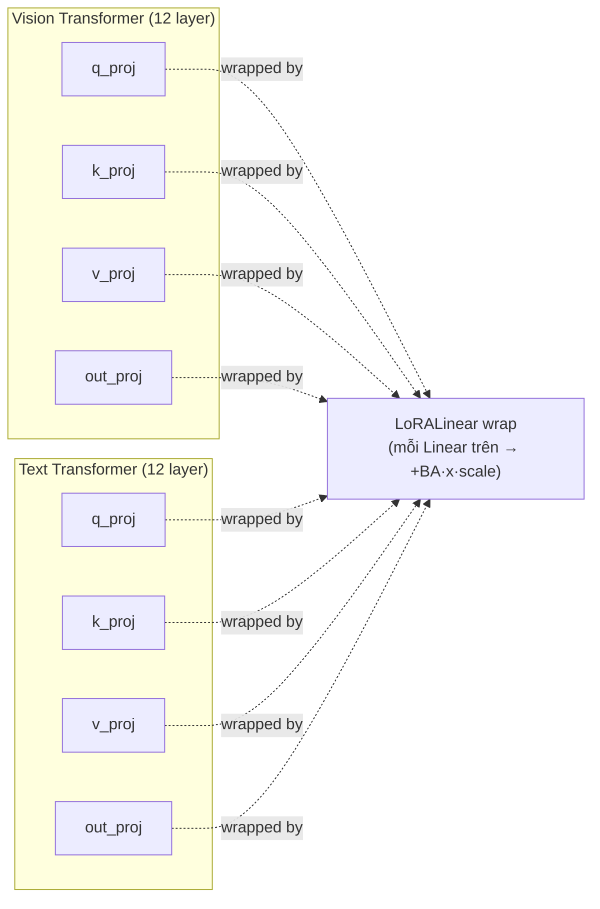
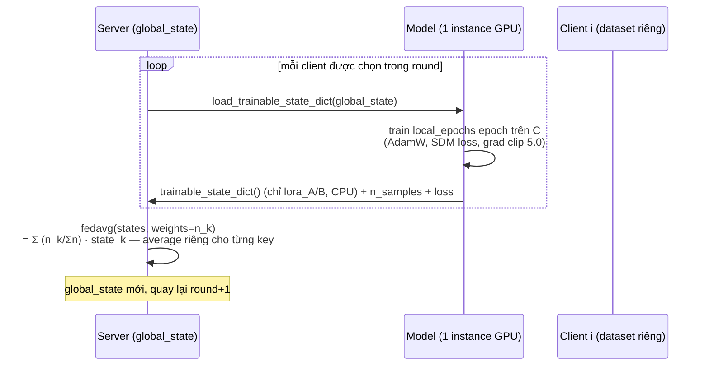

# Báo cáo pipeline: FedAvg + LoRA + CLIP cho Text-Based Person Search (RSTPReid)

> Đọc trực tiếp từ code trong `experiments/clip_lora_fedavg/` và notebook `experiments/notebooks/clip_lora_fedavg_colab.ipynb`. Không có phần nào ở đây là suy diễn — mọi số liệu/tên biến đều trỏ tới file:line cụ thể.

---

## 1. Tổng quan kiến trúc (component diagram)



**Vòng đời một round:** server gửi `global_state` (chỉ LoRA A/B) → mỗi client nạp vào **cùng một** instance CLIP trên GPU, train local, gửi state trainable về → server làm FedAvg → cập nhật `global_state` → (mỗi `eval_every` round) evaluate global model trên test set tập trung.

Vì Colab/1 GPU không đủ VRAM để giữ 15 bản CLIP, code chỉ giữ **một** model, nạp/rút trọng số LoRA cho từng client tuần tự (`federated.py:1-13`, comment nói rõ điều này).

---

## 2. Model: CLIP ViT-B/16 dual-encoder + SDM loss

- Base: `openai/clip-vit-base-patch16` (HuggingFace `CLIPModel`) — **không dùng** các head phụ của IRRA (IRR, MLM, ID classifier).
- Ảnh người có tỉ lệ dọc (384×128), khác ảnh vuông 224×224 mà CLIP gốc train. `resize_position_embedding()` (`clip_model.py:27-57`) nội suy bicubic lưới position-embedding 14×14 → 24×8 (192 patch), và patch `vision_model.embeddings.forward` để bỏ assertion "ảnh phải vuông" của HF (`_patched_vision_embed_forward`, `clip_model.py:17-24`).
- Loss: **SDM (Similarity Distribution Matching)** từ IRRA (`loss.py`). Lý do chọn SDM thay vì loss ID-classification: SDM **không có tham số** (parameter-free) — chỉ cần quan hệ `pid_i == pid_j` trong batch, không cần classifier trên toàn bộ tập ID. Đây là điều kiện **bắt buộc** để FedAvg hoạt động đúng, vì mỗi client có tập ID khác nhau → nếu dùng ID-loss thì mỗi client sẽ có classifier head kích thước khác nhau, không thể average (`README.md` bảng "Design decisions").

---

## 3. LoRA cắm ở đâu?

### 3.1 Vị trí inject

`inject_lora(model, rank, alpha, targets)` (`lora.py:31-40`) quét **toàn bộ** `model.modules()` (đệ quy) và bọc bất kỳ `nn.Linear` có tên khớp `--lora_targets` (mặc định `q_proj,k_proj,v_proj,out_proj`) bằng `LoRALinear`. Vì nó không lọc theo vision/text, LoRA được cắm **đồng thời vào cả 2 nhánh**:



→ với 12 layer × 4 target × 2 encoder (vision+text) = **96 module** được wrap (số thực tế in ra ở `info["n_lora_modules"]` khi chạy).

### 3.2 Công thức (`lora.py:11-28`)

```text
out = W·x + (B·A)·x · (alpha / r)
```

- `W` (base Linear) bị freeze (`requires_grad=False`).
- `lora_A`: shape `[r, in_features]`, init Kaiming.
- `lora_B`: shape `[out_features, r]`, init **zero** → tại bước 0, delta = 0, model = CLIP gốc y nguyên.
- `scaling = alpha / r`.
- Chỉ `lora_A`, `lora_B` có `requires_grad=True` (`mark_trainable`, `lora.py:43-49`) — đây chính là **toàn bộ** phần được truyền đi trong FL (`trainable_state_dict`, `lora.py:52-55`).

Với `--tuning full`, `mark_trainable` set `requires_grad=True` cho **mọi** param (không inject LoRA) — dùng để đo baseline "trả giá bao nhiêu accuracy khi PEFT".

### 3.3 Có hợp lý không? So với UP-Person thì khác gì?

**Đúng, pipeline hiện tại là "cắm LoRA vanilla" vào cả 4 projection (Q,K,V,O) của MHA, ở cả 2 encoder** — không có gì tinh vi hơn. So với UP-Person (`docs/up-person-report.md`) có 2 khác biệt quan trọng:

| Khía cạnh | Pipeline này | UP-Person |
| --- | --- | --- |
| Vị trí LoRA | `q_proj, k_proj, v_proj, out_proj` (mặc định) | **chỉ `k_proj, v_proj`** (Key, Value) |
| Số kỹ thuật PETL | Chỉ LoRA | LoRA **+ S-Prefix + L-Adapter** (3 khối phối hợp, mỗi khối một vai trò: LoRA+Prefix lo "local", Adapter lo "global") |
| Rank | r=4 (default), config cho phép chỉnh | r=16 (RSTPReid) |
| Trainable params | ~0.49M (r=4, 4 target) | 7.4M (toàn bộ unified block) |

Tại sao UP-Person chỉ đặt LoRA trên K,V mà không có Q,O? Theo phân tích Eq.(9) trong paper, LoRA trên K,V sinh ra số hạng bổ sung dạng `QKᵀΔV + QΔKᵀVᵀ + QΔKᵀΔVᵀ` trong attention score — họ xem đây là đủ để bắt "local information", còn Q dùng để **align** với Prefix token (`P_k, P_v` cũng gắn vào K,V) mà không xung đột. Nói cách khác, họ **chọn K,V có chủ đích** để dọn chỗ cho Prefix, không phải ngẫu nhiên.

**Vậy cắm cả Q,K,V,O trong pipeline này có hợp lý không?**

- Về mặt lý thuyết LoRA nói chung: hợp lý — paper LoRA gốc (Hu et al. 2021) cũng thử nhiều tổ hợp Q/K/V/O và Q,V thường đủ; đặt cả 4 chỉ là mở rộng "toàn diện" (dùng nhiều tham số hơn một chút để không bỏ sót). Đây là lựa chọn **baseline generic**, không sai, và code đã để mở qua `--lora_targets` để bạn tự ablate (comment trong `config.py:38-40` đã gợi ý sẵn `k_proj,v_proj` để mô phỏng UP-Person).
- Về mặt **so sánh với UP-Person**: nếu mục tiêu là "PEFT nào tốt hơn trong FL", thì so sánh cần công bằng — hiện tại đang so **LoRA đơn (4 target) trong FL** với **kiến trúc UP-Person hoàn chỉnh (LoRA 2-target + Prefix + Adapter) centralized**. Hai con số không nằm trên cùng một trục. Với thiết kế hiện tại, "cắm hết Q,K,V,O" là một **baseline độc lập, hợp lệ cho câu hỏi "LoRA vanilla hoạt động thế nào dưới FedAvg"**, chứ chưa phải một phép replicate UP-Person.
- **Khuyến nghị**: giữ nguyên baseline hiện tại (đơn giản, dễ debug, đã chạy được) làm B2–B5 như kế hoạch. Nếu muốn có một điểm so sánh gần UP-Person hơn, chạy thêm 1 ablation chỉ đổi `--lora_targets k_proj,v_proj --lora_rank 16` (không cần code mới, chỉ đổi flag) — vẫn chưa có Prefix/Adapter nhưng ít nhất khớp vị trí LoRA. Việc implement đầy đủ Unified PETL (S-Prefix + L-Adapter) là một hạng mục riêng, không "tự nhiên" có trong LoRA của HuggingFace Linear — cần viết module mới nếu muốn đúng UP-Person 100%.
- Tóm gọn tinh thần bạn đang nghĩ đúng: **"tạm thời cứ cắm hết xem như nào đã"** chính là mục đích của baseline này — nó là bước đầu (LoRA vanilla + FedAvg), UP-Person-in-FL sẽ là một hướng mở rộng/so sánh sau, không phải thứ pipeline này đang cố tái tạo.

---

## 4. Config (`config.py`)

| Nhóm | Flag | Default | Ý nghĩa |
|---|---|---|---|
| Data | `--root` | *(required)* | Thư mục RSTPReid (`imgs/`, `data_captions.json`) |
| | `--clip_name` | `openai/clip-vit-base-patch16` | |
| Partition FL | `--partition` | `camera` | `camera` (non-IID theo camera, số client = số camera), `dirichlet` (skew theo pid, `--dirichlet_alpha`), `iid` (chia ngẫu nhiên đều) |
| | `--num_clients` | 15 | Chỉ dùng cho `dirichlet`/`iid` |
| | `--select_clients` | None | Giữ lại 1 tập client cụ thể, **xoá hẳn** data client khác (khác với sampling per-round) |
| FedAvg | `--rounds` | 50 | Số round toàn cục |
| | `--local_epochs` | 1 | Số epoch local mỗi client/round |
| | `--client_fraction` / `--max_clients_per_round` | 1.0 / 0 | Partial participation (0 = không giới hạn) |
| PEFT | `--tuning` | `lora` | `lora` hoặc `full` |
| | `--lora_rank` / `--lora_alpha` | 4 / 8 | r, alpha |
| | `--lora_targets` | `q_proj,k_proj,v_proj,out_proj` | Có thể giảm xuống `k_proj,v_proj` như UP-Person |
| Train | `--batch_size`, `--lr`, `--weight_decay`, `--temperature` | 64, 1e-4, 0.02, 0.02 | lr gợi ý 1e-4 (LoRA) / 1e-5 (full) |
| | `--amp` | True | fp16 autocast, loss tính lại ở fp32 để tránh NaN |
| Ảnh/text | `--img_h/--img_w/--text_len` | 384/128/77 | |
| Eval/log | `--eval_every`, `--ckpt_every` | 5, 1 | |
| Resume | `--fresh` | off | Không có flag này → tự resume từ `checkpoint.pt` nếu có (dùng lại đúng partition cũ) |

Toàn bộ config + số param trainable + MB/round được ghi vào `args.json` mỗi run.

---

## 5. FedAvg hoạt động thế nào

### 5.1 Một round (`main.py:126-174`, `federated.py`)



- `weights = n_k` = **số sample** (số ảnh × 2 caption) của mỗi client → weighted average chuẩn FedAvg, không phải average đơn giản.
- Chỉ **1 model** sống trên GPU (`federated.py` comment đầu file) — vì 15× CLIP ViT-B/16 không fit VRAM Colab. Nạp/rút trọng số tuần tự từng client trong round.
- Uplink mỗi round = `trainable_params × 4 bytes × số client tham gia` (fp32) — với LoRA r=4 (Q,K,V,O): ~0.49M param → ~1.9 MB/client/round; full fine-tuning: ~150M param → ~573 MB/client/round (bảng trong README).

### 5.2 Công thức tổng hợp weight (`fedavg`, `federated.py:23-31`)

Tại round $t$, gọi $S_t$ là tập client được chọn (mặc định = tất cả). Mỗi client $k \in S_t$:

1. Nạp $\theta_{\text{global}}^{(t)}$ (state LoRA global hiện tại) vào model.
2. Train local `local_epochs` epoch trên dữ liệu riêng $\Rightarrow$ thu được $\theta_k^{(t+1)}$ (state LoRA sau khi fine-tune local).
3. Trả về $\theta_k^{(t+1)}$ cùng $n_k$ = số sample của client (số ảnh × 2 caption, `len(dataset)` ở `federated.py:83`).

Server tổng hợp bằng **weighted average theo số sample**, tính **độc lập cho từng tensor key** $j$ (mỗi `lora_A`/`lora_B` của mỗi layer là một key riêng — xem loop `for k in out` trong code):

$$
\theta_{\text{global}, j}^{(t+1)} \;=\; \sum_{k \in S_t} \frac{n_k}{N} \, \theta_{k, j}^{(t+1)}, \qquad N = \sum_{k \in S_t} n_k
$$

Đây đúng là **FedAvg gốc** (McMahan et al. 2017), chỉ khác so với FedAvg "kinh điển" ở chỗ $\theta$ ở đây **không phải toàn bộ trọng số model**, mà chỉ là 2 ma trận LoRA (`lora_A`, `lora_B`) mỗi layer — vì đó là toàn bộ phần `requires_grad=True` (mục 3.2).

**Vì sao đây là nguồn gốc của "LoRA aggregation bias" (mục 5.3 bên dưới):** với mỗi Linear layer, delta thực sự áp dụng vào forward pass là $\Delta W = \text{scaling} \cdot B \cdot A$. Vì $A$ và $B$ được average **tách rời** theo công thức trên, delta của model global là:

$$
\Delta W_{\text{global}} = \text{scaling} \cdot \Big(\sum_k \tfrac{n_k}{N} B_k\Big) \Big(\sum_k \tfrac{n_k}{N} A_k\Big)
$$

— khác với "trung bình đúng" của các delta local:

$$
\overline{\Delta W} = \text{scaling} \cdot \sum_k \tfrac{n_k}{N} \big(B_k A_k\big)
$$

Vì phép nhân ma trận không phân phối qua tổng theo cách này ($\overline{B}\,\overline{A} \neq \overline{BA}$ nói chung), $\Delta W_{\text{global}} \neq \overline{\Delta W}$ — đây chính là bias được nêu trong FedIT/FFA-LoRA/FLoRA/LoRA-FAIR (mục 5.3 dưới).

### 5.3 Giới hạn đã biết (ghi rõ trong `federated.py` docstring + README)

1. **LoRA aggregation bias**: FedAvg average `A` và `B` **riêng biệt**, nhưng `Avg(B)·Avg(A) ≠ Avg(B·A)`. Đây là vấn đề đã biết (FedIT/FFA-LoRA/FLoRA/LoRA-FAIR) — baseline này **chấp nhận** bias này để lấy điểm tham chiếu, và đây chính là chỗ có thể đề xuất phương pháp mới cho luận văn.
2. **Camera ≠ label-space disjoint**: mỗi ID xuất hiện ở ~5/15 camera → partition theo camera tạo ra **feature/domain skew**, không phải disjoint theo nhãn.
3. Client quá ít ID có thể làm SDM suy biến (không đủ positive pair trong batch).

---

## 6. Evaluation (`evaluate.py`)

- **Luôn luôn đánh giá model global**, trên **1 tập test tập trung ở server** (200 identity, `README.md`), **không** đánh giá per-client.
- Quy trình mỗi lần eval (`main.py:146-157`):
  1. `load_trainable_state_dict(model, global_state)` — nạp LoRA global vào model.
  2. `extract_features`: encode toàn bộ ảnh test bằng `get_image_features`, toàn bộ caption test bằng `get_text_features`, normalize L2.
  3. `compute_metrics`: text→image retrieval — với mỗi caption query, sort ảnh theo cosine similarity, tính **R@1/5/10** (CMC), **mAP**, **mINP** (rank của positive khó nhất).
- Model tốt nhất theo R@1 được lưu riêng vào `best.pt` (chỉ chứa `global_state`, không phải state của client nào).

---

## 7. Inference thực tế — trả lời câu hỏi "train fed rồi infer thế nào?"

**Đúng, infer hoàn toàn bình thường — giống một model CLIP+LoRA centralized, không có gì "liên bang" ở bước infer cả.** Cụ thể:

- LoRA không tạo ra kiến trúc khác nhau giữa client — nó chỉ **cộng thêm một delta nhỏ** (`B·A·x·scale`) vào Linear gốc (mục 3.2). Sau khi FedAvg xong, `global_state` chỉ là 2 tensor `lora_A`, `lora_B` cho mỗi module đã inject — **hoàn toàn tương thích** với cấu trúc model gốc (`build_model` dùng đúng args `lora_rank/lora_alpha/lora_targets` như lúc train).
- Để infer: dựng lại model bằng `build_model(args)` (freeze + inject LoRA giống lúc train) → `load_trainable_state_dict(model, global_state)` (nạp state từ `best.pt` hoặc `checkpoint.pt`) → `model.eval()` → gọi `get_image_features` / `get_text_features` như bất kỳ CLIP model bình thường. Đây đúng là những gì `evaluate.py` đang làm — infer production sẽ làm giống hệt, chỉ khác là chạy trên query thật thay vì test set.
- **Không có bước "chọn client" hay "route theo client" ở inference.** Server chỉ deploy **một** bộ trọng số global duy nhất (base CLIP frozen + LoRA global đã average). Người dùng cuối dùng đúng model đó cho mọi ảnh/câu query, bất kể ảnh đó "giống" client nào lúc train.

### Vậy weight của từng client (local LoRA state) dùng để làm gì?

Chỉ để **tạo ra global_state** — chúng là **input trung gian cho phép tính average**, không phải sản phẩm cuối:

- Mỗi client, sau khi train local, trả về `state_k` (LoRA A/B đã fine-tune trên data riêng của nó) + `n_k` (số sample) → gửi lên server (`train_one_client`, `federated.py:34-83`).
- Server dùng **tất cả** `state_k` của round đó để tính `global_state = Σ (n_k/Σn)·state_k` (`fedavg`, `federated.py:23-31`), rồi **vứt bỏ** — code hiện tại không hề lưu `state_k` xuống đĩa, chỉ giữ trong list `states` tạm trong vòng lặp round rồi mất đi ngay khi qua round sau.
- Nói cách khác: state client tồn tại đúng 1 round, mục đích duy nhất là "hướng cập nhật cục bộ" để server tổng hợp thành 1 hướng cập nhật chung. Sau khi average, không có khái niệm "model của client 3" được deploy hay giữ lại ở đâu cả — chỉ `global_state` (checkpoint) mới có ý nghĩa lâu dài và là thứ được dùng ở bước inference.

**Tóm lại theo đúng nghĩa FedAvg kinh điển:** train là hợp tác (nhiều client đóng góp gradient/update), nhưng inference là tập trung — 1 model, 1 bộ trọng số, dùng cho mọi request, không khác gì so với model được train centralized. Sự khác biệt so với centralized chỉ nằm ở **cách trọng số đó được tạo ra** (average từ N update local thay vì 1 lần train trên toàn bộ data gộp), không nằm ở cách nó được **dùng**.

---

## 8. File output mỗi run (từ README, xác nhận qua `main.py`)

| File | Nội dung |
|---|---|
| `log.csv` | round, loss, R@1/5/10, mAP, mINP, cumulative uplink (MB), elapsed time |
| `partition.json` | partition đã dùng (để reproduce / resume) |
| `partition_stats.json` | số ảnh/ID/caption mỗi client, CV, Jaccard trung bình giữa client |
| `args.json` | toàn bộ config + trainable params + MB/round/client |
| `checkpoint.pt` | `global_state` + round + best_r1 + cum_uplink → dùng để **resume** training |
| `best.pt` | `global_state` tốt nhất theo R@1 → dùng để **inference/deploy** |

---

## 9. Ba số cần rút ra cho luận văn (từ README)

- **FL gap** = B0 (centralized, không FL) − B2 (FL IID + full FT) — chi phí của việc phân tán.
- **Non-IID gap** = B3 (FL IID + LoRA) − B5 (FL camera non-IID + LoRA) — chi phí riêng của non-IID.
- **PEFT gap** = B4 (FL non-IID + full FT) − B5 (FL non-IID + LoRA) — accuracy đánh đổi cho ~300x giảm communication.
