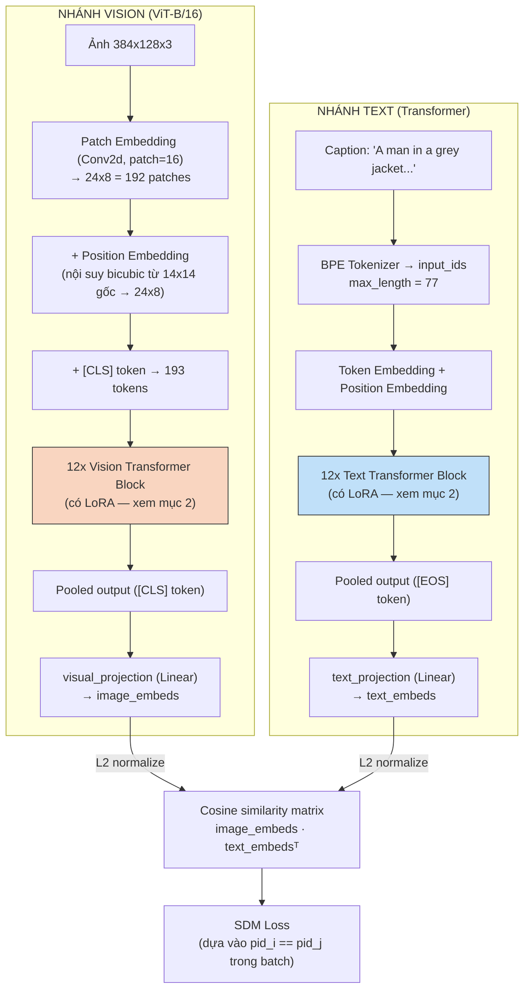
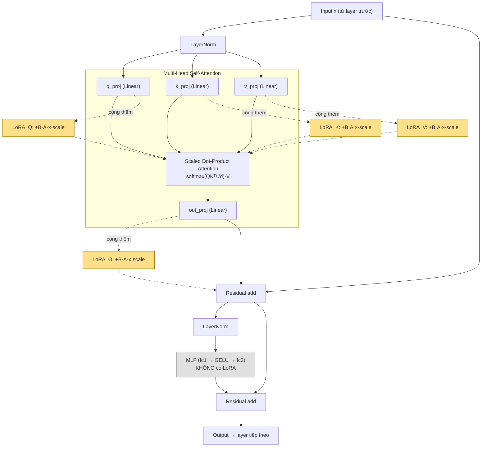
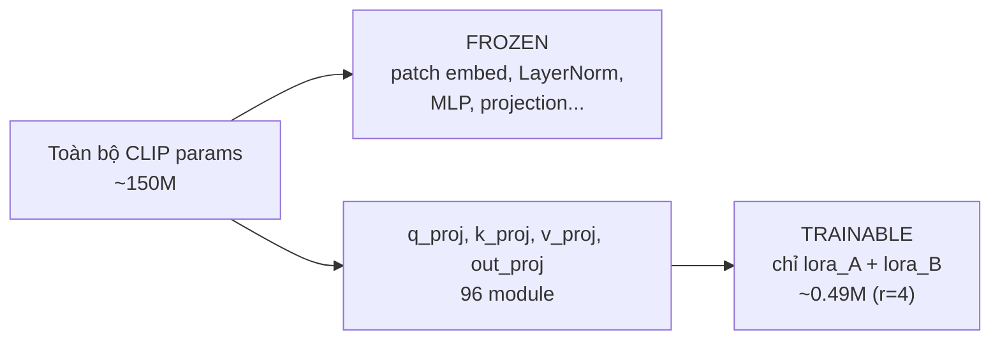
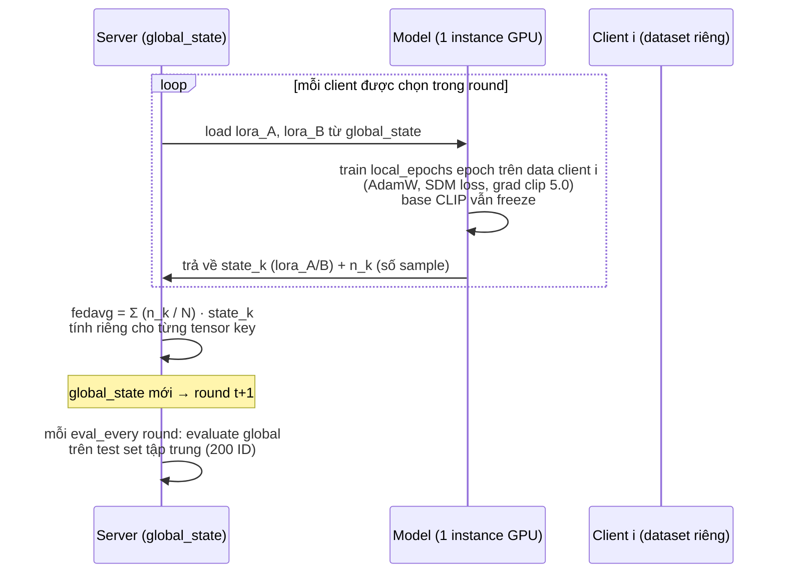

# Báo cáo Tuần 11 — CLIP + LoRA + FedAvg cho Text-Based Person Search

> Đối tượng: pipeline baseline `experiments/clip_lora_fedavg/` trên dataset RSTPReid.
> Mọi mô tả kỹ thuật dưới đây đọc trực tiếp từ code, không suy diễn.

---

## Mục lục

1. [Tổng quan mô hình & Loss](#1-tổng-quan-mô-hình--loss)
2. [LoRA cắm vào transformer block](#2-lora-cắm-vào-transformer-block)
3. [FedAvg: các bước, công thức, và khác biệt khi áp lên LoRA](#3-fedavg-các-bước-công-thức-và-khác-biệt-khi-áp-lên-lora)
4. [Chỉ số cần rút ra](#4-ba-chỉ-số-cần-rút-ra-cho-luận-văn)

---

## 1. Tổng quan mô hình & Loss

### 1.1 Kiến trúc CLIP dual-encoder

Base model: `openai/clip-vit-base-patch16` (HuggingFace `CLIPModel`), gồm **2 nhánh độc lập hoàn toàn về trọng số**, chỉ gặp nhau ở bước cuối khi tính cosine similarity.



### 1.2 Điều chỉnh cho bài toán person search

Ảnh người có tỉ lệ dọc **384×128**, khác input vuông 224×224 mà CLIP gốc được pretrain. Pipeline xử lý bằng 2 bước:

- Nội suy bicubic lưới position-embedding từ **14×14 → 24×8** (192 patch) — `resize_position_embedding()`.
- Patch lại `vision_model.embeddings.forward` để bỏ assertion "ảnh phải vuông" của HuggingFace.

Ngoài ra pipeline **không dùng** các head phụ của IRRA (IRR, MLM, ID classifier) — lý do gắn liền với FL, xem ngay dưới.

### 1.3 Loss: SDM (Similarity Distribution Matching)

SDM lấy từ IRRA: xây phân phối nhãn mềm dựa trên quan hệ `pid_i == pid_j` **trong batch**, rồi khớp phân phối similarity image↔text với phân phối đó qua KL divergence.

**Vì sao bắt buộc phải là loss parameter-free như SDM:**

| Nếu dùng ID-classification loss | Hệ quả trong FL |
|---|---|
| Mỗi client cần head `[feat_dim, num_ids_của_client]` | Mỗi client có **tập ID khác nhau, số lượng khác nhau** → shape head khác nhau → **không average được** |
| Kể cả khi shape trùng nhau | Cột thứ *i* ở client A và client B ứng với **2 người khác nhau** → average là vô nghĩa về mặt ngữ nghĩa |

SDM **không có tham số học được nào** → phần trọng số trao đổi giữa client và server đồng nhất tuyệt đối, FedAvg chạy đúng. Đây là ràng buộc thiết kế, không phải lựa chọn tùy ý.

---

## 2. LoRA cắm vào transformer block

### 2.1 Cắm chính xác ở đâu

`inject_lora()` quét đệ quy toàn bộ `model.modules()`, thay thế mọi `nn.Linear` **có tên khớp** `--lora_targets` bằng `LoRALinear`:

```python
for module in model.modules():
    for name, child in list(module.named_children()):
        if name in targets and isinstance(child, nn.Linear):
            setattr(module, name, LoRALinear(child, rank, alpha))
```

Default `--lora_targets = q_proj,k_proj,v_proj,out_proj` → đúng 4 Linear projection bên trong khối **self-attention** của mỗi block.



**Không bị đụng tới (freeze hoàn toàn):** patch embedding (Conv2d), token/position embedding, LayerNorm, MLP `fc1/fc2`, `visual_projection`/`text_projection`. Riêng MLP tuy cũng là `nn.Linear` nhưng tên attribute không nằm trong `targets` nên không bị wrap — muốn thêm chỉ cần đổi flag, không cần sửa code.

**Quy mô:** 12 layer × 4 target × 2 encoder = **96 LoRALinear module**, mỗi module có cặp `(lora_A, lora_B)` riêng, không share giữa layer hay giữa 2 nhánh.

### 2.2 Công thức

$$
\text{out} = \underbrace{W x}_{\text{freeze}} \;+\; \underbrace{(B A)\, x \cdot \frac{\alpha}{r}}_{\text{trainable}}
$$

- `lora_A ∈ R^{r×d_in}`: init Kaiming uniform.
- `lora_B ∈ R^{d_out×r}`: init **zero** → tại step 0 delta = 0, model đúng bằng CLIP pretrained → khởi đầu ổn định, không phá pretrained weight.
- `scaling = alpha / r`.
- Chỉ `lora_A`, `lora_B` có `requires_grad=True` — đây là **toàn bộ** phần được truyền đi trong FL.

Với r=4: **~0.49M** trainable params so với **~150M** của full fine-tuning (**~300×** ít hơn).



### 2.3 Vì sao cắm ở attention projection, và tác dụng

**Vì sao:** attention là nơi model quyết định "nhìn vào đâu". Thích nghi domain (ảnh người / mô tả người) chủ yếu là thay đổi *pattern chú ý*, không phải thay đổi feature extractor cấp thấp. Paper LoRA gốc (Hu et al. 2021) ablate nhiều tổ hợp và thấy Q/V (hoặc Q,K,V,O) hiệu quả nhất trên mỗi đơn vị tham số. Cắm cả 4 là baseline generic "phủ hết"; có thể ablate xuống `k_proj,v_proj` (như UP-Person) chỉ bằng đổi flag.

**Tác dụng — 3 mặt, mặt thứ 3 là lý do chính trong FL:**

1. **Tiết kiệm bộ nhớ/compute khi train** — chỉ backward qua nhánh adapter, không cần optimizer state cho 150M params.
2. **Chống catastrophic forgetting** — base CLIP giữ nguyên, delta nhỏ có kiểm soát → ít overfit trên dataset nhỏ của từng client.
3. **Giảm communication cost — điểm quyết định** — mỗi round client chỉ gửi ~0.49M float32 ≈ **1.9 MB**, thay vì ~**573 MB** nếu full fine-tune.

---

## 3. FedAvg: các bước, công thức, và khác biệt khi áp lên LoRA

### 3.1 Các bước một round



1. **Broadcast** — server gửi `global_state` (chỉ `lora_A`/`lora_B` của 96 module) xuống các client được chọn.
2. **Local training** — client nạp state, train `local_epochs` epoch trên data riêng.
3. **Upload** — trả về `state_k` + `n_k` (số sample = số ảnh × 2 caption).
4. **Aggregate** — server weighted-average theo `n_k`.
5. **Lặp lại**; mỗi `eval_every` round evaluate `global_state` trên test set tập trung. Luôn đánh giá model global, **không** đánh giá per-client.

> **Lưu ý triển khai:** vì 1 GPU (Colab) không đủ VRAM giữ 15 bản CLIP, code chỉ giữ **một** model instance và nạp/rút trọng số LoRA tuần tự từng client. Về thuật toán vẫn tương đương FedAvg chuẩn — mọi client đều xuất phát từ cùng `global_state`.

### 3.2 Công thức tổng hợp

Tại round $t$, tập client tham gia $S_t$, tính **độc lập cho từng tensor key** $j$ (mỗi `lora_A`/`lora_B` của mỗi layer là một key riêng):

$$
\theta_{\text{global},j}^{(t+1)} \;=\; \sum_{k \in S_t} \frac{n_k}{N} \, \theta_{k,j}^{(t+1)}, \qquad N = \sum_{k \in S_t} n_k
$$

Trọng số là **số sample**, không phải average đơn giản — client nhiều data hơn đóng góp nhiều hơn. Đây đúng là FedAvg gốc (McMahan et al. 2017), chỉ khác ở chỗ $\theta$ không phải toàn bộ trọng số model mà chỉ là 2 ma trận LoRA mỗi layer.

### 3.3 Vì sao FedAvg hiệu quả

Với `local_epochs = 1` và mô hình gần tuyến tính, một bước local là $\theta_k = \theta_g - \eta \nabla L_k(\theta_g)$. Thay vào công thức average:

$$
\sum_k \frac{n_k}{N}\theta_k \;=\; \theta_g - \eta \sum_k \frac{n_k}{N}\nabla L_k(\theta_g) \;=\; \theta_g - \eta \nabla L_{\text{global}}(\theta_g)
$$

→ **average trọng số ≈ một bước gradient descent trên loss toàn cục**, vì gradient trung bình có trọng số theo $n_k$ chính là gradient của loss trên toàn bộ data gộp. Đây là lý do FedAvg hội tụ được mà không cần gửi data. Sai lệch chỉ phát sinh khi `local_epochs > 1` (client drift) hoặc data non-IID mạnh.

### 3.4 Khác gì so với FedAvg trên pipeline thường (vd: tune block transformer cuối)?

Đây là **điểm mấu chốt** của báo cáo tuần này.

| | Tune block cuối (weight trực tiếp) | LoRA (weight phân rã) |
|---|---|---|
| Tham số gửi đi | Chính là $W$ | Là $A, B$ — **factor** của $\Delta W = BA$ |
| Average có tuyến tính không? | **Có** | **Không** |
| Kết quả | $\overline{W}$ đúng nghĩa trung bình | $\overline{B}\,\overline{A} \ne \overline{BA}$ |
| Lý thuyết hội tụ FedAvg | Áp dụng trực tiếp | Không áp dụng trực tiếp |

Ba khác biệt cụ thể, tăng dần về mức nghiêm trọng:

**(a) Tính phi tuyến — "LoRA aggregation bias"**

Cái thực sự tác động vào forward pass là $\Delta W = \text{scaling}\cdot BA$. Server average $A$ và $B$ **tách rời**, cho ra:

$$
\Delta W_{\text{global}} = \text{scaling}\cdot\Big(\sum_k \tfrac{n_k}{N}B_k\Big)\Big(\sum_k \tfrac{n_k}{N}A_k\Big)
$$

trong khi trung bình *đúng* của các update local phải là:

$$
\overline{\Delta W} = \text{scaling}\cdot\sum_k \tfrac{n_k}{N}\big(B_k A_k\big)
$$

Hai vế **khác nhau** (nhân ma trận không phân phối qua tổng); phần chênh lệch chính là các số hạng chéo $B_k A_{k'}$ với $k \ne k'$ — tức **trộn nhầm** factor của client này với factor của client kia. Với pipeline tune block cuối, $\theta$ chính là $W$, average là phép tuyến tính → **không có bias này**.

**(b) Vấn đề rank**

$\overline{\Delta W}$ đúng là tổng của $K$ ma trận rank-$r$ → rank có thể lên tới $K\cdot r$. Nhưng $\overline{B}\,\overline{A}$ luôn có rank $\le r$. FedAvg trên LoRA vì thế **bóp nghẹt** không gian update xuống rank $r$, mất thông tin khi các client học hướng khác nhau — đúng kịch bản non-IID theo camera của pipeline này.

**(c) Bất định của phân rã (nghiêm trọng nhất về mặt khái niệm)**

Phân rã LoRA **không duy nhất**: với ma trận khả nghịch $T$ bất kỳ, $(BT)(T^{-1}A)$ cho ra cùng $\Delta W$. Hai client có thể học ra **cùng một** $\Delta W$ nhưng $A, B$ hoàn toàn khác nhau → average trong **không gian factor** là average những đại lượng không cùng hệ quy chiếu. Với weight trực tiếp không có sự bất định này.

### 3.5 Định hướng nghiên cứu

Pipeline hiện tại **cố ý chấp nhận** bias này để lấy baseline tham chiếu "LoRA vanilla dưới FedAvg". Đây chính là khoảng trống để đề xuất cải tiến:

| Hướng | Ý tưởng |
|---|---|
| **FFA-LoRA** | Freeze $A$, chỉ average $B$ → khôi phục tính tuyến tính của phép average |
| **FLoRA** | Reconstruct đúng $\overline{BA}$ trên server rồi phân rã lại |
| **LoRA-FAIR** | Hiệu chỉnh residual trên server để bù phần sai lệch |

### 3.6 Giới hạn đã biết khác

1. **Camera ≠ label-space disjoint** — mỗi ID xuất hiện ở ~5/15 camera → partition theo camera tạo **feature/domain skew**, không phải disjoint theo nhãn.
2. **Client quá ít ID** có thể làm SDM suy biến (không đủ positive pair trong batch).

---

## 4. Ba chỉ số cần rút ra cho luận văn

| Chỉ số | Công thức | Ý nghĩa |
|---|---|---|
| **FL gap** | B0 (centralized) − B2 (FL IID + full FT) | Chi phí của việc phân tán |
| **Non-IID gap** | B3 (FL IID + LoRA) − B5 (FL camera non-IID + LoRA) | Chi phí riêng của non-IID |
| **PEFT gap** | B4 (FL non-IID + full FT) − B5 (FL non-IID + LoRA) | Accuracy đánh đổi cho ~300× giảm communication |

**Chi phí giao tiếp để đối chiếu:**

| Cấu hình | Trainable params | Uplink / client / round |
|---|---|---|
| LoRA r=4 (Q,K,V,O) | ~0.49M | ~1.9 MB |
| Full fine-tuning | ~150M | ~573 MB |
